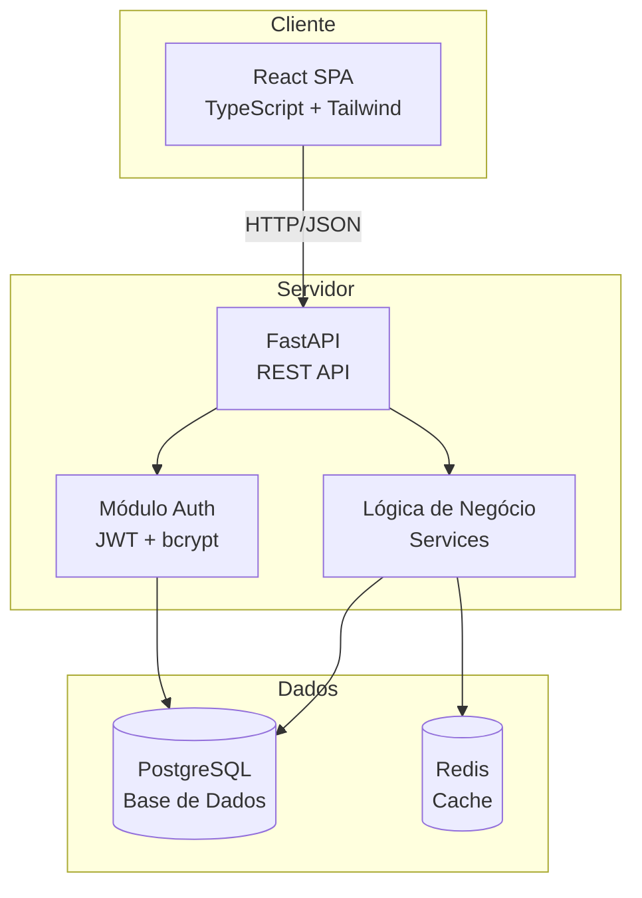
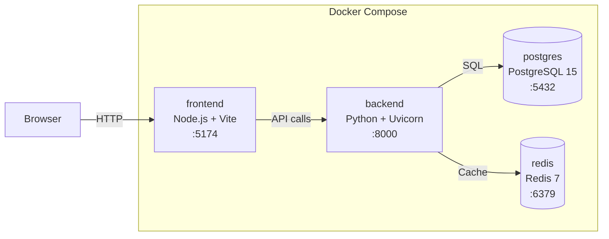
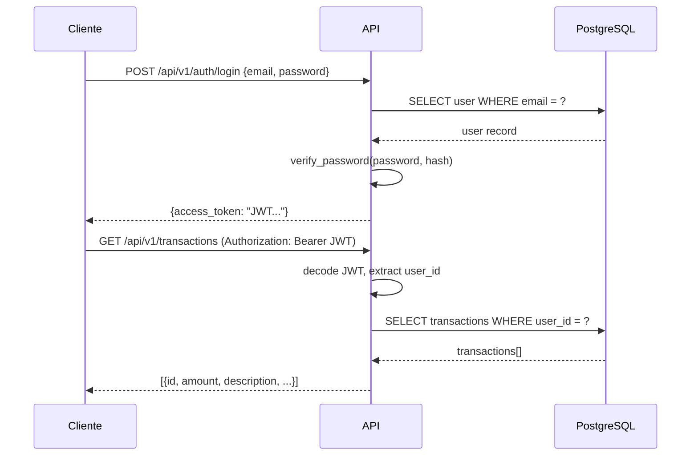

# FinTwin — Arquitetura do Sistema

## 1. Visão Geral

O FinTwin segue uma arquitetura **cliente-servidor** com separação clara entre frontend (SPA) e backend (REST API). Toda a comunicação é feita via HTTP/JSON com autenticação JWT.

---

## 2. Diagrama de Arquitetura



---

## 3. Diagrama de Deployment (Docker Compose)



### Containers

| Container | Imagem | Porta | Função |
|-----------|--------|-------|--------|
| `frontend` | Node 20 + Vite | 5174 | Servir a SPA React |
| `backend` | Python 3.12 + Uvicorn | 8000 | REST API + lógica de negócio |
| `postgres` | PostgreSQL 15 | 5432 | Base de dados relacional |
| `redis` | Redis 7 | 6379 | Cache de dados (taxas de câmbio, scores) |

---

## 4. Camadas da Aplicação

### 4.1 Frontend (React SPA)

```
frontend/src/
├── pages/           ← Componentes de página (1 por rota)
├── components/
│   ├── layout/      ← AppLayout, Sidebar, ProtectedRoute
│   ├── ui/          ← Componentes reutilizáveis (modais, cards, rows)
│   └── charts/      ← Gráficos (Recharts)
├── hooks/           ← Custom hooks para API (useAuth, useTransactions, etc.)
├── services/
│   └── api.ts       ← Instância Axios com interceptors JWT
└── styles/
    └── globals.css   ← Design system (Tailwind layers)
```

**Responsabilidades:**
- Renderização da interface (React 18)
- Gestão de estado local (hooks + context)
- Comunicação com API via Axios
- Routing (React Router v6)
- Dark mode (ThemeProvider + CSS variables)

### 4.2 Backend (FastAPI)

```
backend/app/
├── api/
│   ├── routes/      ← Handlers por domínio (auth, transactions, budgets, etc.)
│   └── deps.py      ← Dependências (get_current_user)
├── models/          ← Modelos SQLAlchemy (ORM)
├── schemas/         ← Schemas Pydantic (validação request/response)
├── services/        ← Lógica de negócio (categorização, etc.)
└── core/
    ├── database.py  ← Engine async + SessionLocal
    ├── security.py  ← JWT + bcrypt
    ├── cache.py     ← Helpers Redis
    └── limiter.py   ← Rate limiting (SlowAPI)
```

**Responsabilidades:**
- Validação de requests (Pydantic v2)
- Autenticação e autorização (JWT Bearer)
- Lógica de negócio (services/)
- Acesso a dados (SQLAlchemy async)
- Rate limiting nos endpoints sensíveis

### 4.3 Base de Dados (PostgreSQL)

- Modelo relacional com 6 tabelas core (Sprint 1)
- Migrações geridas por Alembic
- UUIDs como chaves primárias
- Relações com CASCADE e SET NULL conforme o caso
- Índices nos campos mais consultados (email, account_id, transaction_date)

### 4.4 Cache (Redis)

- Cache de dados temporários (taxas de câmbio, scores calculados)
- TTL configurável (1 hora por defeito)
- Graceful degradation — a app funciona mesmo sem Redis

---

## 5. Comunicação

### 5.1 API REST

- Prefixo: `/api/v1`
- Formato: JSON
- Autenticação: Bearer Token (JWT)
- Paginação: `?limit=50&offset=0`
- Updates parciais: PATCH (apenas campos alterados)

### 5.2 Fluxo de Autenticação



---

## 6. Decisões Arquiteturais

| Decisão | Justificação |
|---------|-------------|
| SPA + REST API | Separação clara frontend/backend, facilita desenvolvimento independente |
| Async (FastAPI + SQLAlchemy) | Melhor performance com I/O concorrente (DB queries, cache) |
| JWT stateless | Sem necessidade de sessões server-side, escalável horizontalmente |
| Docker Compose | Ambiente de desenvolvimento reprodutível, deploy simplificado |
| PostgreSQL | Suporte a UUIDs nativos, tipos ricos, migrações com Alembic |
| Redis | Cache rápido para dados temporários, reduz carga na DB |
