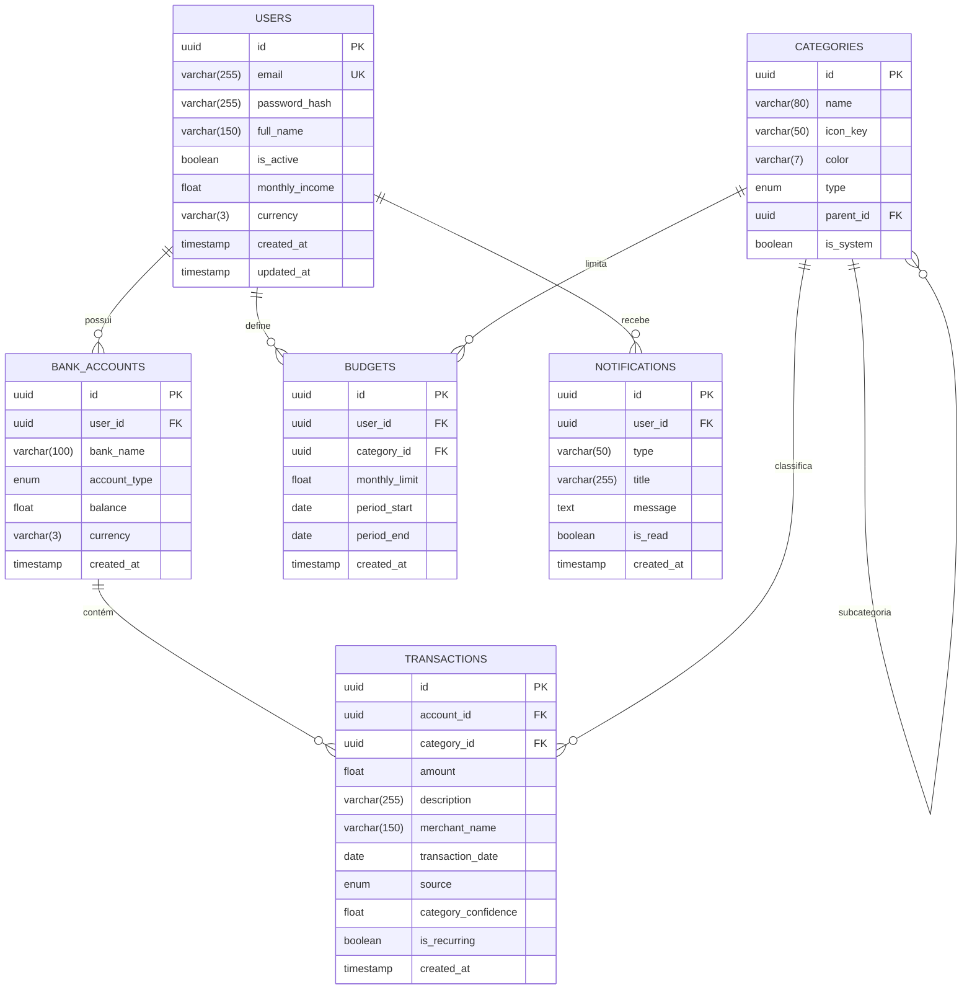

# FinTwin — Modelo de Dados (Sprint 1)

## 1. Diagrama Entidade-Relacionamento

---

## 2. Descrição das Entidades

### 2.1 Users (Utilizadores)

Armazena as credenciais e dados pessoais de cada utilizador.

| Campo | Tipo | Restrições | Descrição |
|-------|------|-----------|-----------|
| `id` | UUID | PK, auto-generated | Identificador único |
| `email` | VARCHAR(255) | UNIQUE, INDEX | Email de login |
| `password_hash` | VARCHAR(255) | NOT NULL | Hash bcrypt da password |
| `full_name` | VARCHAR(150) | NOT NULL | Nome completo |
| `is_active` | BOOLEAN | DEFAULT true | Conta ativa/desativada |
| `monthly_income` | FLOAT | NULLABLE | Rendimento mensal declarado |
| `currency` | VARCHAR(3) | DEFAULT 'EUR' | Moeda preferida (ISO 4217) |
| `created_at` | TIMESTAMP(tz) | auto | Data de registo |
| `updated_at` | TIMESTAMP(tz) | auto | Última atualização |

### 2.2 Bank_Accounts (Contas Bancárias)

Cada utilizador pode ter múltiplas contas bancárias.

| Campo | Tipo | Restrições | Descrição |
|-------|------|-----------|-----------|
| `id` | UUID | PK | Identificador único |
| `user_id` | UUID | FK → users.id, CASCADE | Proprietário da conta |
| `bank_name` | VARCHAR(100) | NOT NULL | Nome do banco (ex: Caixa Geral) |
| `account_type` | ENUM | checking/savings/investment | Tipo de conta |
| `balance` | FLOAT | DEFAULT 0.0 | Saldo atual |
| `currency` | VARCHAR(3) | DEFAULT 'EUR' | Moeda da conta |
| `created_at` | TIMESTAMP(tz) | auto | Data de criação |

### 2.3 Transactions (Transações)

Movimentos financeiros associados a uma conta bancária.

| Campo | Tipo | Restrições | Descrição |
|-------|------|-----------|-----------|
| `id` | UUID | PK | Identificador único |
| `account_id` | UUID | FK → bank_accounts.id, CASCADE, INDEX | Conta associada |
| `category_id` | UUID | FK → categories.id, SET NULL, NULLABLE | Categoria (manual ou auto) |
| `amount` | FLOAT | NOT NULL | Valor (negativo = despesa, positivo = receita) |
| `description` | VARCHAR(255) | NOT NULL | Descrição do movimento |
| `merchant_name` | VARCHAR(150) | NULLABLE | Nome do comerciante |
| `transaction_date` | DATE | INDEX | Data do movimento |
| `source` | ENUM | manual/csv/open_banking | Origem do registo |
| `category_confidence` | FLOAT | NULLABLE | Confiança da categorização automática (0.0-1.0) |
| `is_recurring` | BOOLEAN | DEFAULT false | Marcada como recorrente |
| `created_at` | TIMESTAMP(tz) | auto | Data de criação |

### 2.4 Categories (Categorias)

Categorias predefinidas (sistema) e customizáveis para classificar transações.

| Campo | Tipo | Restrições | Descrição |
|-------|------|-----------|-----------|
| `id` | UUID | PK | Identificador único |
| `name` | VARCHAR(80) | INDEX | Nome da categoria |
| `icon_key` | VARCHAR(50) | DEFAULT 'default' | Chave do ícone SVG |
| `color` | VARCHAR(7) | DEFAULT '#6366F1' | Cor em hex |
| `type` | ENUM | income/expense | Tipo (receita ou despesa) |
| `parent_id` | UUID | FK → categories.id, NULLABLE | Categoria pai (subcategorias) |
| `is_system` | BOOLEAN | DEFAULT false | Predefinida pelo sistema |

**Categorias predefinidas (seed):** Restauração, Supermercado, Transportes, Saúde, Educação, Entretenimento, Habitação, Serviços, Vestuário, Tecnologia, Viagens, Outros.

### 2.5 Budgets (Orçamentos)

Limites de gastos mensais por categoria.

| Campo | Tipo | Restrições | Descrição |
|-------|------|-----------|-----------|
| `id` | UUID | PK | Identificador único |
| `user_id` | UUID | FK → users.id, CASCADE, INDEX | Proprietário |
| `category_id` | UUID | FK → categories.id, CASCADE | Categoria do orçamento |
| `monthly_limit` | FLOAT | NOT NULL | Limite mensal em EUR |
| `period_start` | DATE | NOT NULL | Início do período |
| `period_end` | DATE | NOT NULL | Fim do período |
| `created_at` | TIMESTAMP(tz) | auto | Data de criação |

### 2.6 Notifications (Notificações)

Alertas e avisos para o utilizador.

| Campo | Tipo | Restrições | Descrição |
|-------|------|-----------|-----------|
| `id` | UUID | PK | Identificador único |
| `user_id` | UUID | FK → users.id, CASCADE | Destinatário |
| `type` | VARCHAR(50) | NOT NULL | Tipo (low_balance, budget_exceeded, etc.) |
| `title` | VARCHAR(255) | NOT NULL | Título do alerta |
| `message` | TEXT | NOT NULL | Conteúdo |
| `is_read` | BOOLEAN | DEFAULT false | Lida/não lida |
| `created_at` | TIMESTAMP(tz) | auto | Data de criação |

---

## 3. Relações

| Relação | Tipo | Descrição |
|---------|------|-----------|
| Users → Bank_Accounts | 1:N | Um utilizador possui várias contas |
| Users → Budgets | 1:N | Um utilizador define vários orçamentos |
| Users → Notifications | 1:N | Um utilizador recebe várias notificações |
| Bank_Accounts → Transactions | 1:N | Uma conta contém várias transações |
| Categories → Transactions | 1:N | Uma categoria classifica várias transações |
| Categories → Budgets | 1:N | Uma categoria pode ter vários orçamentos |
| Categories → Categories | 1:N | Suporte a subcategorias (self-referential) |

---

## 4. Regras de Integridade

- **CASCADE DELETE**: Ao eliminar um utilizador, todas as suas contas, transações, orçamentos e notificações são removidos
- **SET NULL**: Ao eliminar uma categoria, as transações associadas mantêm-se mas perdem a referência (category_id = NULL)
- **UUIDs**: Todas as chaves primárias usam UUID v4 gerado automaticamente
- **Índices**: Campos com queries frequentes (email, account_id, transaction_date) estão indexados
