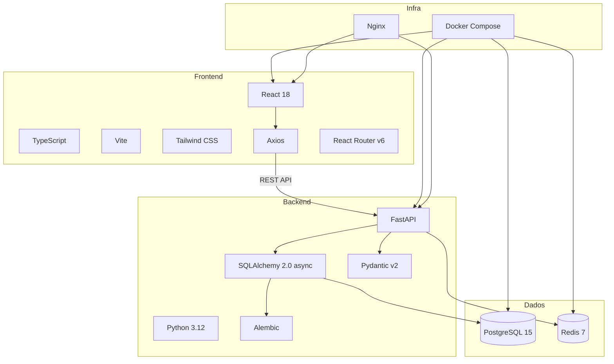

# FinTwin — Stack Tecnologico

## 1. Visao Geral

O FinTwin utiliza uma stack moderna e amplamente adotada na industria, privilegiando performance, type-safety e facilidade de desenvolvimento.

---

## 2. Tabela de Tecnologias

### Backend

| Componente | Tecnologia | Versao | Justificacao |
|-----------|------------|--------|-------------|
| Linguagem | Python | 3.12 | Ecossistema rico, otimo para APIs e processamento de dados |
| Framework | FastAPI | 0.100+ | Alta performance (async), validacao automatica, docs OpenAPI |
| ORM | SQLAlchemy | 2.0 | ORM maduro com suporte async nativo, type hints |
| Migracoes | Alembic | 1.13+ | Gestao de migracoes de schema (up/down), integrado com SQLAlchemy |
| Validacao | Pydantic | 2.0 | Validacao de dados com type hints, serialization automatica |
| Base de Dados | PostgreSQL | 15 | Robusta, suporte nativo a UUIDs, tipos ricos, transacoes ACID |
| Cache | Redis | 7 | Cache in-memory ultra-rapido, TTL configuravel |
| Auth | PyJWT + bcrypt | — | JWT stateless + hashing seguro de passwords (12 rounds) |
| Rate Limiting | SlowAPI | — | Protecao contra brute-force nos endpoints de auth |
| Testes | Pytest | 7+ | Framework de testes padrao em Python, fixtures, async support |

### Frontend

| Componente | Tecnologia | Versao | Justificacao |
|-----------|------------|--------|-------------|
| Linguagem | TypeScript | 5.0+ | Type-safety, autocompletion, menos bugs em runtime |
| Framework | React | 18 | Biblioteca UI mais popular, componentes reutilizaveis, hooks |
| Build Tool | Vite | 5+ | Build rapido com HMR, suporte nativo a TypeScript |
| Routing | React Router | 6 | Routing declarativo, nested routes, protected routes |
| HTTP Client | Axios | 1.6+ | Interceptors para JWT, error handling uniforme |
| Styling | Tailwind CSS | 3 | Utility-first, design system via CSS variables, dark mode |
| Graficos | Recharts | 2+ | Graficos React baseados em D3, responsivos |
| PDF | jsPDF + AutoTable | — | Geracao de relatorios PDF no browser |

### Infraestrutura

| Componente | Tecnologia | Justificacao |
|-----------|------------|-------------|
| Containerizacao | Docker + Docker Compose | Ambiente reprodutivel, deploy simplificado |
| Reverse Proxy | Nginx | Servir frontend em producao, proxy para backend |
| Controlo de Versao | Git + GitHub | Versionamento de codigo, colaboracao |

---

## 3. Diagrama de Stack

---

## 4. Justificacao das Escolhas

### Porque FastAPI em vez de Django/Flask?

- **Performance**: FastAPI e uma das frameworks Python mais rapidas (baseada em Starlette/uvicorn)
- **Async nativo**: Suporte a `async/await` em toda a stack (DB, cache, HTTP)
- **Documentacao automatica**: Swagger UI e ReDoc gerados a partir dos type hints
- **Validacao integrada**: Pydantic v2 valida requests/responses automaticamente
- **Type hints**: Autocompletion superior no IDE

### Porque React em vez de Vue/Angular?

- **Ecossistema**: Maior comunidade, mais bibliotecas disponiveis
- **Flexibilidade**: Nao impoe estrutura rigida, adaptavel ao projeto
- **Hooks**: Custom hooks permitem reutilizacao de logica (useAuth, useTransactions, etc.)
- **TypeScript**: Suporte de primeira classe

### Porque PostgreSQL em vez de MySQL/SQLite?

- **UUIDs nativos**: Tipo `uuid` nativo, sem conversoes
- **Tipos ricos**: Enums, arrays, JSON, date ranges
- **Concorrencia**: MVCC com isolamento de transacoes robusto
- **Escalabilidade**: Adequado para producao futura

### Porque Docker Compose?

- **Reprodutibilidade**: O mesmo ambiente em qualquer maquina
- **Isolamento**: Cada servico no seu container
- **Simplicidade**: Um comando (`docker compose up`) levanta toda a infraestrutura
- **Producao**: Mesma stack para desenvolvimento e deploy
