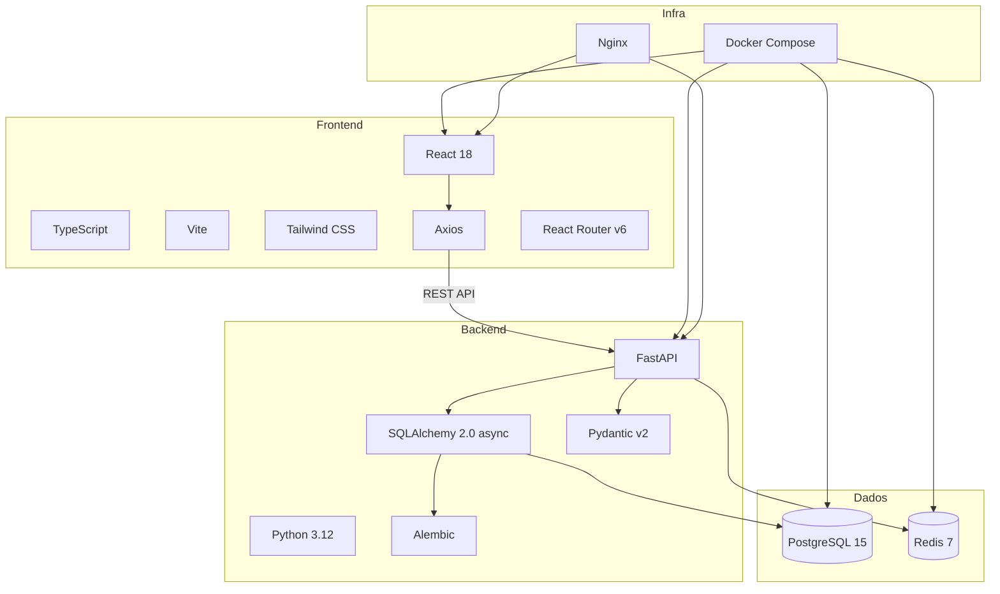

# FinTwin — Stack Tecnológico

## 1. Visão Geral

O FinTwin utiliza uma stack moderna e amplamente adotada na indústria, privilegiando performance, type-safety e facilidade de desenvolvimento.

---

## 2. Tabela de Tecnologias

### Backend

| Componente | Tecnologia | Versão | Justificação |
|-----------|------------|--------|-------------|
| Linguagem | Python | 3.12 | Ecossistema rico, ótimo para APIs e processamento de dados |
| Framework | FastAPI | 0.100+ | Alta performance (async), validação automática, docs OpenAPI |
| ORM | SQLAlchemy | 2.0 | ORM maduro com suporte async nativo, type hints |
| Migrações | Alembic | 1.13+ | Gestão de migrações de schema (up/down), integrado com SQLAlchemy |
| Validação | Pydantic | 2.0 | Validação de dados com type hints, serialização automática |
| Base de Dados | PostgreSQL | 15 | Robusta, suporte nativo a UUIDs, tipos ricos, transações ACID |
| Cache | Redis | 7 | Cache in-memory ultra-rápido, TTL configurável |
| Auth | PyJWT + bcrypt | — | JWT stateless + hashing seguro de passwords (12 rounds) |
| Rate Limiting | SlowAPI | — | Proteção contra brute-force nos endpoints de auth |
| Testes | Pytest | 7+ | Framework de testes padrão em Python, fixtures, async support |

### Frontend

| Componente | Tecnologia | Versão | Justificação |
|-----------|------------|--------|-------------|
| Linguagem | TypeScript | 5.0+ | Type-safety, autocompletion, menos bugs em runtime |
| Framework | React | 18 | Biblioteca UI mais popular, componentes reutilizáveis, hooks |
| Build Tool | Vite | 5+ | Build rápido com HMR, suporte nativo a TypeScript |
| Routing | React Router | 6 | Routing declarativo, nested routes, protected routes |
| HTTP Client | Axios | 1.6+ | Interceptors para JWT, error handling uniforme |
| Styling | Tailwind CSS | 3 | Utility-first, design system via CSS variables, dark mode |
| Gráficos | Recharts | 2+ | Gráficos React baseados em D3, responsivos |
| PDF | jsPDF + AutoTable | — | Geração de relatórios PDF no browser |

### Infraestrutura

| Componente | Tecnologia | Justificação |
|-----------|------------|-------------|
| Containerização | Docker + Docker Compose | Ambiente reprodutível, deploy simplificado |
| Reverse Proxy | Nginx | Servir frontend em produção, proxy para backend |
| Controlo de Versão | Git + GitHub | Versionamento de código, colaboração |

---

## 3. Diagrama de Stack

---

## 4. Justificação das Escolhas

### Porquê FastAPI em vez de Django/Flask?

- **Performance**: FastAPI é uma das frameworks Python mais rápidas (baseada em Starlette/uvicorn)
- **Async nativo**: Suporte a `async/await` em toda a stack (DB, cache, HTTP)
- **Documentação automática**: Swagger UI e ReDoc gerados a partir dos type hints
- **Validação integrada**: Pydantic v2 valida requests/responses automaticamente
- **Type hints**: Autocompletion superior no IDE

### Porquê React em vez de Vue/Angular?

- **Ecossistema**: Maior comunidade, mais bibliotecas disponíveis
- **Flexibilidade**: Não impõe estrutura rígida, adaptável ao projeto
- **Hooks**: Custom hooks permitem reutilização de lógica (useAuth, useTransactions, etc.)
- **TypeScript**: Suporte de primeira classe

### Porquê PostgreSQL em vez de MySQL/SQLite?

- **UUIDs nativos**: Tipo `uuid` nativo, sem conversões
- **Tipos ricos**: Enums, arrays, JSON, date ranges
- **Concorrência**: MVCC com isolamento de transações robusto
- **Escalabilidade**: Adequado para produção futura

### Porquê Docker Compose?

- **Reprodutibilidade**: O mesmo ambiente em qualquer máquina
- **Isolamento**: Cada serviço no seu container
- **Simplicidade**: Um comando (`docker compose up`) levanta toda a infraestrutura
- **Produção**: Mesma stack para desenvolvimento e deploy
