# FinTwin — Casos de Uso (Sprint 1)

## 1. Diagrama de Casos de Uso

```mermaid
graph TB
    Actor((Utilizador))

    subgraph Autenticação
        UC01[UC01: Registar Conta]
        UC02[UC02: Fazer Login]
        UC03[UC03: Fazer Logout]
    end

    subgraph Contas Bancárias
        UC04[UC04: Criar Conta Bancária]
        UC05[UC05: Listar Contas]
        UC06[UC06: Editar Conta]
        UC07[UC07: Eliminar Conta]
    end

    subgraph Transações
        UC08[UC08: Adicionar Transação]
        UC09[UC09: Listar Transações]
        UC10[UC10: Importar CSV]
        UC11[UC11: Editar Transação]
    end

    subgraph Orçamentos
        UC12[UC12: Criar Orçamento]
        UC13[UC13: Ver Resumo Orçamental]
        UC14[UC14: Eliminar Orçamento]
    end

    subgraph Dashboard
        UC15[UC15: Ver Dashboard]
    end

    subgraph Perfil
        UC16[UC16: Editar Perfil]
    end

    Actor --> UC01
    Actor --> UC02
    Actor --> UC03
    Actor --> UC04
    Actor --> UC05
    Actor --> UC06
    Actor --> UC07
    Actor --> UC08
    Actor --> UC09
    Actor --> UC10
    Actor --> UC11
    Actor --> UC12
    Actor --> UC13
    Actor --> UC14
    Actor --> UC15
    Actor --> UC16
```



---

## 2. Descrições Detalhadas

---

### UC01 — Registar Conta

| Campo | Descrição |
|-------|-----------|
| **Ator** | Utilizador não autenticado |
| **Pré-condição** | O utilizador não possui conta no sistema |
| **Pós-condição** | Conta criada na base de dados; JWT emitido; utilizador redirecionado para o onboarding |
| **Requisito** | RF01 |

**Fluxo Principal:**
1. O utilizador acede à página de registo (`/register`)
2. Preenche os campos: nome completo, email, password
3. Opcionalmente preenche: rendimento mensal, moeda preferida
4. Clica em "Criar Conta"
5. O sistema valida os dados (email formato válido, password mínimo 6 caracteres)
6. O sistema verifica que o email não está registado
7. O sistema cria a conta com password encriptada (bcrypt, 12 rounds)
8. O sistema emite um JWT e armazena-o no localStorage
9. O utilizador é redirecionado para o wizard de onboarding

**Fluxos Alternativos:**

| ID | Condição | Ação |
|----|----------|------|
| 5a | Email com formato inválido | Sistema exibe "Email inválido" |
| 5b | Password com menos de 6 caracteres | Sistema exibe "Password demasiado curta" |
| 6a | Email já registado | Sistema exibe "Este email já está registado" (HTTP 409) |

---

### UC02 — Fazer Login

| Campo | Descrição |
|-------|-----------|
| **Ator** | Utilizador registado, não autenticado |
| **Pré-condição** | O utilizador possui conta ativa no sistema |
| **Pós-condição** | JWT armazenado no localStorage; utilizador redirecionado para o dashboard |
| **Requisito** | RF02 |

**Fluxo Principal:**
1. O utilizador acede à página de login (`/login`)
2. Preenche email e password
3. Clica em "Entrar"
4. O sistema verifica as credenciais na base de dados
5. O sistema gera um JWT com o ID do utilizador
6. O token é armazenado no localStorage do browser
7. O utilizador é redirecionado para o dashboard (`/`)

**Fluxos Alternativos:**

| ID | Condição | Ação |
|----|----------|------|
| 4a | Email não encontrado | Sistema exibe "Email ou password incorretos" (HTTP 401) |
| 4b | Password incorreta | Sistema exibe "Email ou password incorretos" (HTTP 401) |
| 4c | Rate limit excedido (>10 tentativas/min) | Sistema exibe "Demasiadas tentativas, tenta novamente mais tarde" (HTTP 429) |

**Nota de segurança:** A mensagem de erro é genérica para não revelar se o email existe no sistema.

---

### UC03 — Fazer Logout

| Campo | Descrição |
|-------|-----------|
| **Ator** | Utilizador autenticado |
| **Pré-condição** | JWT válido no localStorage |
| **Pós-condição** | JWT removido; utilizador redirecionado para login |
| **Requisito** | RF02 |

**Fluxo Principal:**
1. O utilizador clica no botão "Sair" na sidebar
2. O sistema remove o JWT do localStorage
3. O utilizador é redirecionado para a página de login (`/login`)

---

### UC04 — Criar Conta Bancária

| Campo | Descrição |
|-------|-----------|
| **Ator** | Utilizador autenticado |
| **Pré-condição** | Utilizador com sessão ativa |
| **Pós-condição** | Nova conta bancária criada e associada ao utilizador |
| **Requisito** | RF03 |

**Fluxo Principal:**
1. O utilizador navega para o perfil ou clica em "Nova Conta" no dashboard
2. O modal de criação de conta abre
3. O utilizador preenche: nome do banco, tipo de conta (corrente/poupança/investimento), saldo atual
4. Clica em "Criar Conta"
5. O sistema valida os dados (nome obrigatório)
6. O sistema cria a conta bancária na base de dados
7. O modal fecha e a lista de contas é atualizada

**Fluxos Alternativos:**

| ID | Condição | Ação |
|----|----------|------|
| 5a | Nome do banco vazio | Sistema exibe "Nome do banco é obrigatório" |
| 3a | Utilizador clica "Cancelar" | Modal fecha sem criar conta |

---

### UC05 — Listar Contas

| Campo | Descrição |
|-------|-----------|
| **Ator** | Utilizador autenticado |
| **Pré-condição** | Utilizador com sessão ativa |
| **Pós-condição** | Lista de contas bancárias apresentada |
| **Requisito** | RF03 |

**Fluxo Principal:**
1. O utilizador acede à página de perfil (`/profile`)
2. O sistema carrega as contas bancárias do utilizador via API
3. As contas são apresentadas em cards com: nome do banco, tipo, saldo, moeda

**Fluxos Alternativos:**

| ID | Condição | Ação |
|----|----------|------|
| 3a | Sem contas registadas | Sistema exibe mensagem "Ainda não tens contas bancárias" com CTA para criar |

---

### UC06 — Editar Conta

| Campo | Descrição |
|-------|-----------|
| **Ator** | Utilizador autenticado |
| **Pré-condição** | Existe pelo menos uma conta bancária registada |
| **Pós-condição** | Dados da conta atualizados na base de dados |
| **Requisito** | RF03 |

**Fluxo Principal:**
1. O utilizador acede à página de perfil (`/profile`)
2. Clica em "Editar" numa conta bancária existente
3. O modal de edição abre com os dados atuais pré-preenchidos
4. O utilizador altera os campos pretendidos (nome do banco, tipo, saldo)
5. Clica em "Guardar Alterações"
6. O sistema valida e atualiza os dados via PATCH na API
7. O modal fecha e a lista de contas é atualizada

**Fluxos Alternativos:**

| ID | Condição | Ação |
|----|----------|------|
| 5a | Nome do banco vazio | Sistema exibe "Nome do banco é obrigatório" |
| 4a | Utilizador clica "Cancelar" | Modal fecha sem guardar alterações |

---

### UC07 — Eliminar Conta

| Campo | Descrição |
|-------|-----------|
| **Ator** | Utilizador autenticado |
| **Pré-condição** | Existe pelo menos uma conta bancária registada |
| **Pós-condição** | Conta e todas as suas transações eliminadas (CASCADE) |
| **Requisito** | RF03 |

**Fluxo Principal:**
1. O utilizador acede à página de perfil (`/profile`)
2. Clica em "Eliminar" numa conta bancária
3. O sistema apresenta diálogo de confirmação: "Tens a certeza? Todas as transações associadas serão eliminadas."
4. O utilizador confirma a eliminação
5. O sistema elimina a conta e todas as transações associadas (CASCADE)
6. A lista de contas é atualizada; o saldo total no dashboard é recalculado

**Fluxos Alternativos:**

| ID | Condição | Ação |
|----|----------|------|
| 4a | Utilizador cancela o diálogo | Nenhuma alteração é feita |

---

### UC08 — Adicionar Transação

| Campo | Descrição |
|-------|-----------|
| **Ator** | Utilizador autenticado |
| **Pré-condição** | Utilizador tem pelo menos uma conta bancária |
| **Pós-condição** | Transação criada e categorizada; cache de scores invalidado |
| **Requisito** | RF04 |

**Fluxo Principal:**
1. O utilizador clica em "Nova Transação" na página de transações
2. O modal de adicionar transação abre
3. O utilizador preenche: descrição, valor (negativo = despesa), data, conta de destino
4. Opcionalmente seleciona uma categoria
5. Clica em "Adicionar"
6. O sistema valida os dados
7. Se nenhuma categoria foi selecionada, o sistema executa a categorização automática com base na descrição
8. A transação é guardada na base de dados
9. O modal fecha e a lista de transações é atualizada

**Fluxos Alternativos:**

| ID | Condição | Ação |
|----|----------|------|
| 6a | Descrição ou valor vazio | Sistema exibe mensagem de validação |
| 4a | Utilizador não tem contas | Botão desativado; mensagem "Cria uma conta primeiro" |
| 7a | Categorização automática sem resultado | Transação guardada sem categoria (category_id = NULL) |

---

### UC09 — Listar Transações

| Campo | Descrição |
|-------|-----------|
| **Ator** | Utilizador autenticado |
| **Pré-condição** | Sessão ativa |
| **Pós-condição** | Lista paginada de transações apresentada |
| **Requisito** | RF06 |

**Fluxo Principal:**
1. O utilizador navega para a página de transações (`/transactions`)
2. O sistema carrega as transações mais recentes (limite: 50, offset: 0)
3. As transações são apresentadas agrupadas por data
4. Cada transação mostra: descrição, valor, categoria (com ícone e cor), data, comerciante
5. O utilizador pode filtrar por: tipo (receita/despesa), categoria, período

**Fluxos Alternativos:**

| ID | Condição | Ação |
|----|----------|------|
| 3a | Sem transações | Estado vazio com mensagem e CTA para adicionar |
| 5a | Filtro sem resultados | Mensagem "Nenhuma transação encontrada com estes filtros" |

---

### UC10 — Importar CSV

| Campo | Descrição |
|-------|-----------|
| **Ator** | Utilizador autenticado |
| **Pré-condição** | Pelo menos uma conta bancária; ficheiro CSV no formato correto |
| **Pós-condição** | N transações importadas e categorizadas automaticamente |
| **Requisito** | RF05 |

**Fluxo Principal:**
1. O utilizador clica em "Importar CSV" na página de transações
2. O modal de importação abre
3. O utilizador seleciona a conta de destino
4. Arrasta ou seleciona o ficheiro CSV
5. O sistema lê o ficheiro e apresenta pré-visualização das primeiras 5 linhas
6. O utilizador vê o número total de linhas detetadas
7. Clica em "Confirmar Import"
8. O sistema processa cada linha: parse da data, descrição, valor e comerciante
9. Cada transação é categorizada automaticamente
10. O sistema retorna o número de transações importadas com sucesso
11. O modal fecha e a lista de transações é atualizada

**Fluxos Alternativos:**

| ID | Condição | Ação |
|----|----------|------|
| 4a | Ficheiro não é CSV | Sistema exibe "Apenas ficheiros CSV são aceites" |
| 8a | Formato de data inválido | Transação ignorada; erro reportado |
| 8b | Colunas em falta | Sistema exibe "Erro ao importar. Verifica o formato do ficheiro" |

**Formato CSV esperado:**
```
date,description,amount,merchant
2026-01-15,Supermercado Continente,-45.30,Continente
2026-01-16,Salario,1500.00,Empresa XYZ
```

---

### UC11 — Editar Transação

| Campo | Descrição |
|-------|-----------|
| **Ator** | Utilizador autenticado |
| **Pré-condição** | Existe pelo menos uma transação registada |
| **Pós-condição** | Dados da transação atualizados na base de dados |
| **Requisito** | RF04 |

**Fluxo Principal:**
1. O utilizador acede à página de transações (`/transactions`)
2. Clica em "Editar" numa transação existente
3. O modal de edição abre com os dados atuais pré-preenchidos
4. O utilizador altera os campos pretendidos (descrição, valor, data, categoria)
5. Clica em "Guardar"
6. O sistema valida e atualiza os dados via PATCH na API
7. O modal fecha e a lista de transações é atualizada

**Fluxos Alternativos:**

| ID | Condição | Ação |
|----|----------|------|
| 5a | Descrição ou valor inválido | Sistema exibe mensagem de validação |
| 4a | Utilizador clica "Cancelar" | Modal fecha sem guardar alterações |

---

### UC12 — Criar Orçamento

| Campo | Descrição |
|-------|-----------|
| **Ator** | Utilizador autenticado |
| **Pré-condição** | Existem categorias no sistema |
| **Pós-condição** | Orçamento mensal criado para a categoria selecionada |
| **Requisito** | RF09 |

**Fluxo Principal:**
1. O utilizador navega para a página de orçamentos (`/budgets`)
2. Clica em "Novo Orçamento"
3. Seleciona a categoria (ex: Restauração, Transportes)
4. Define o limite mensal (ex: 200 EUR)
5. O sistema define automaticamente o período (mês atual até fim do ano)
6. Clica em "Criar"
7. O sistema guarda o orçamento e apresenta o card com barra de progresso

**Fluxos Alternativos:**

| ID | Condição | Ação |
|----|----------|------|
| 3a | Nenhuma categoria disponível | Mensagem de erro |
| 4a | Limite inferior a 1 EUR | Validação impede a criação |

---

### UC13 — Ver Resumo Orçamental

| Campo | Descrição |
|-------|-----------|
| **Ator** | Utilizador autenticado |
| **Pré-condição** | Existem orçamentos criados para o período atual |
| **Pós-condição** | Resumo orçamental apresentado com barras de progresso |
| **Requisito** | RF09 |

**Fluxo Principal:**
1. O utilizador acede à página de orçamentos (`/budgets`)
2. O sistema carrega os orçamentos do mês atual
3. Para cada orçamento, o sistema calcula o total gasto na categoria no período
4. São apresentados cards com: nome da categoria, valor gasto/limite, barra de progresso colorida
5. A barra é verde abaixo de 80%, laranja entre 80–100%, vermelha acima de 100%
6. O resumo do mês no rodapé mostra o total orçamentado vs. total gasto

**Fluxos Alternativos:**

| ID | Condição | Ação |
|----|----------|------|
| 2a | Sem orçamentos criados | Estado vazio com CTA para criar o primeiro orçamento |

---

### UC14 — Eliminar Orçamento

| Campo | Descrição |
|-------|-----------|
| **Ator** | Utilizador autenticado |
| **Pré-condição** | Existe pelo menos um orçamento criado |
| **Pós-condição** | Orçamento eliminado; as transações associadas não são afetadas |
| **Requisito** | RF09 |

**Fluxo Principal:**
1. O utilizador acede à página de orçamentos (`/budgets`)
2. Clica em "Apagar" num card de orçamento
3. O sistema elimina o orçamento via DELETE na API
4. O card desaparece da lista

**Fluxos Alternativos:**

| ID | Condição | Ação |
|----|----------|------|
| 3a | Erro de rede | Sistema exibe mensagem de erro e mantém o card |

---

### UC15 — Ver Dashboard

| Campo | Descrição |
|-------|-----------|
| **Ator** | Utilizador autenticado |
| **Pré-condição** | Sessão ativa |
| **Pós-condição** | Dashboard apresentado com dados atualizados |
| **Requisito** | RF07 |

**Fluxo Principal:**
1. O utilizador acede ao dashboard (`/`) após login
2. O sistema carrega em paralelo: contas bancárias, transações recentes, resumo mensal
3. O dashboard apresenta:
   - Saldo total (soma de todas as contas)
   - Receitas e despesas do mês atual
   - Últimas transações (5-10 mais recentes)
   - Gráfico de distribuição de despesas por categoria
4. Se o utilizador é novo (sem contas), apresenta o wizard de onboarding

**Fluxos Alternativos:**

| ID | Condição | Ação |
|----|----------|------|
| 4a | Utilizador novo | Wizard de onboarding é apresentado (4 passos) |
| 2a | Erro ao carregar dados | Mensagem de erro com botão "Tentar novamente" |

---

### UC16 — Editar Perfil

| Campo | Descrição |
|-------|-----------|
| **Ator** | Utilizador autenticado |
| **Pré-condição** | Sessão ativa |
| **Pós-condição** | Dados do perfil atualizados |
| **Requisito** | RF10 |

**Fluxo Principal:**
1. O utilizador navega para o perfil (`/profile`)
2. O sistema apresenta os dados atuais: nome, email, rendimento mensal, moeda
3. O utilizador edita os campos desejados
4. Clica em "Guardar Alterações"
5. O sistema valida e atualiza os dados via PUT /api/v1/auth/me
6. Confirmação visual de sucesso (toast notification)

**Fluxos Alternativos:**

| ID | Condição | Ação |
|----|----------|------|
| 5a | Dados inválidos | Mensagem de validação nos campos afetados |

---

## 3. Matriz Casos de Uso vs Requisitos Funcionais

| Caso de Uso | RF01 | RF02 | RF03 | RF04 | RF05 | RF06 | RF07 | RF08 | RF09 | RF10 |
|-------------|:----:|:----:|:----:|:----:|:----:|:----:|:----:|:----:|:----:|:----:|
| UC01 Registar | X | | | | | | | | | |
| UC02 Login | | X | | | | | | | | |
| UC03 Logout | | X | | | | | | | | |
| UC04 Criar Conta | | | X | | | | | | | |
| UC05 Listar Contas | | | X | | | | | | | |
| UC06 Editar Conta | | | X | | | | | | | |
| UC07 Eliminar Conta | | | X | | | | | | | |
| UC08 Adicionar Txn | | | | X | | | | X | | |
| UC09 Listar Txn | | | | | | X | | | | |
| UC10 Importar CSV | | | | | X | | | X | | |
| UC11 Editar Txn | | | | X | | | | | | |
| UC12 Criar Orçamento | | | | | | | | | X | |
| UC13 Ver Resumo Orc. | | | | | | | | | X | |
| UC14 Eliminar Orc. | | | | | | | | | X | |
| UC15 Ver Dashboard | | | | | | | X | | | |
| UC16 Editar Perfil | | | | | | | | | | X |
