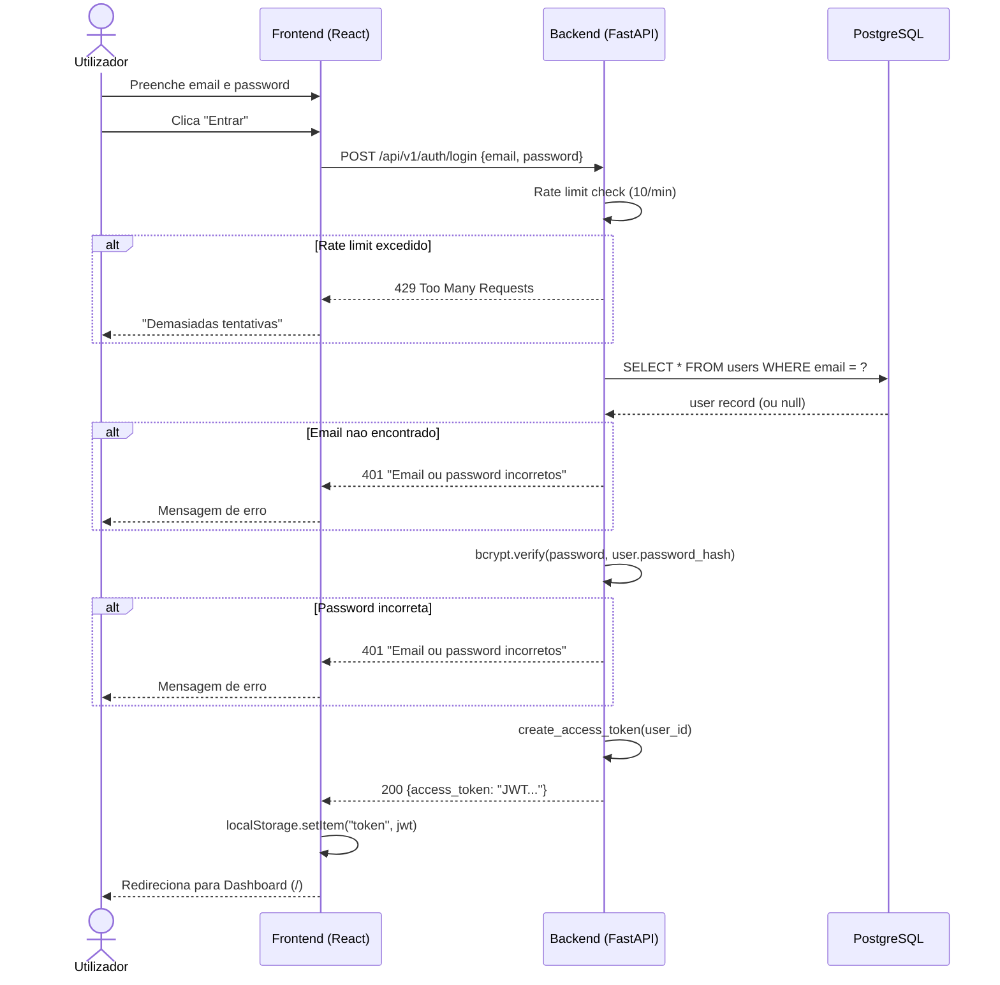
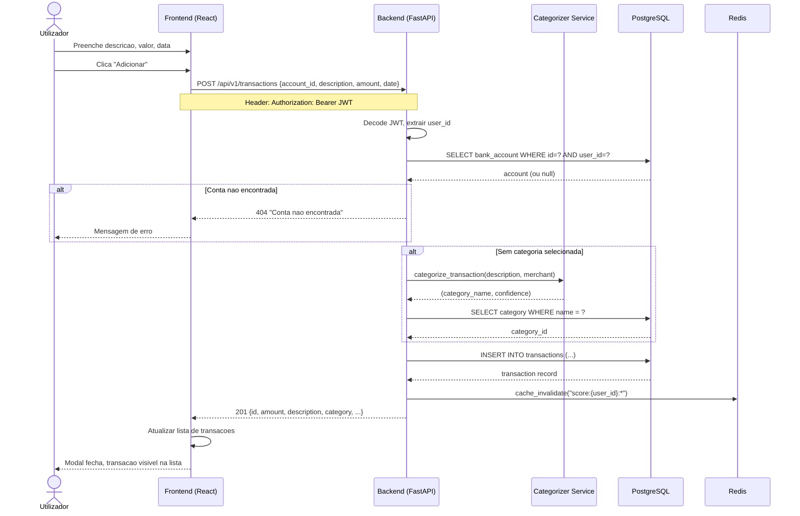
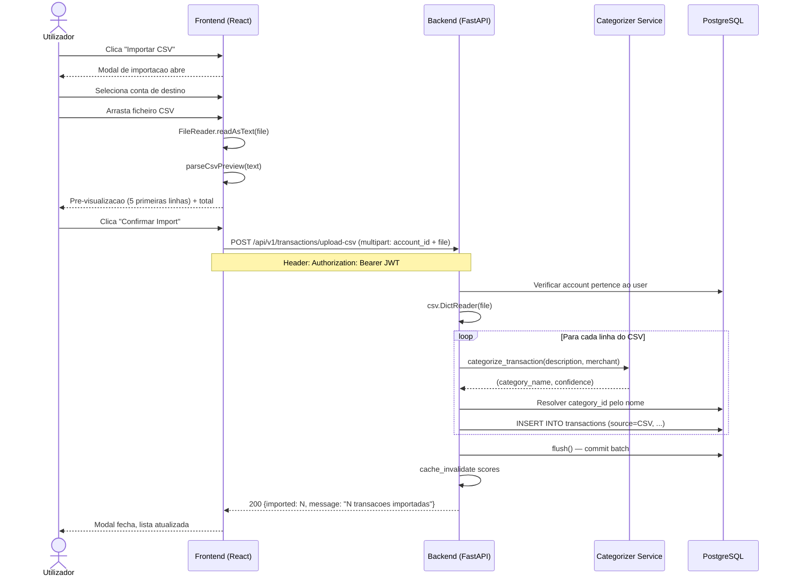
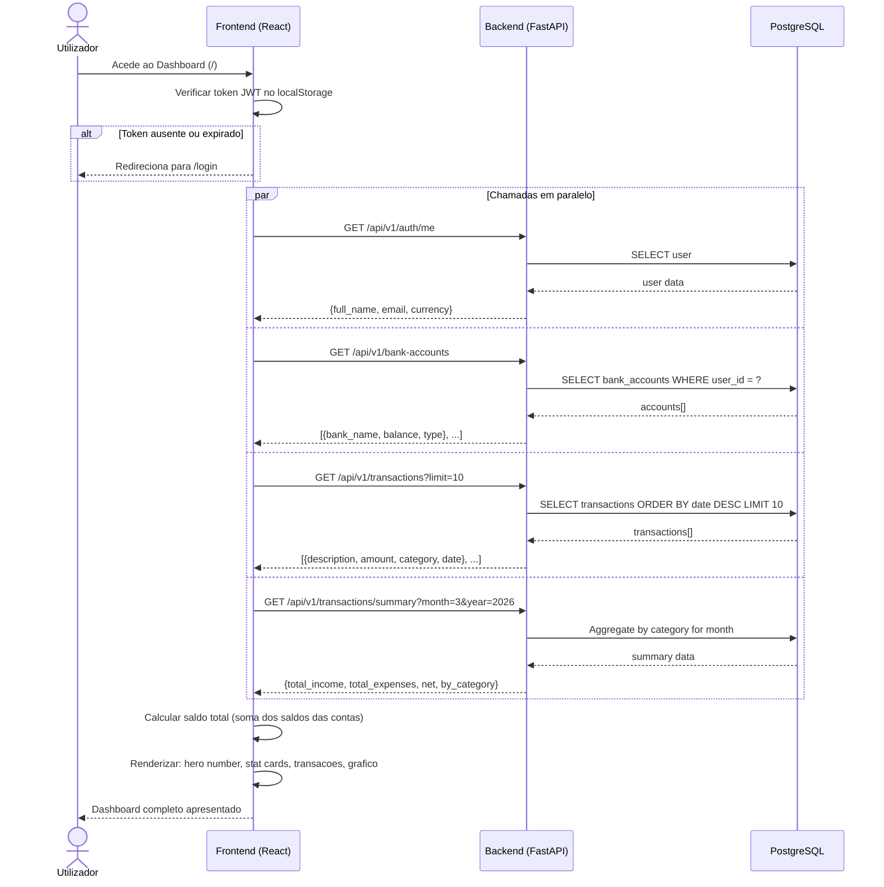
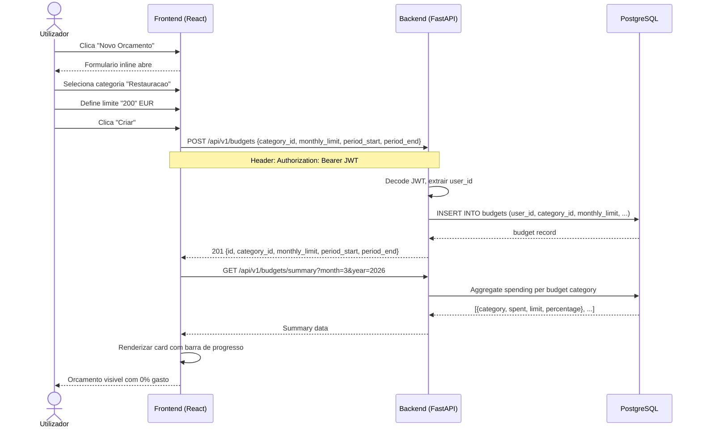

# FinTwin — Diagramas de Sequencia (Sprint 1)

## DS01 — Login do Utilizador

---

## DS02 — Criar Transacao

---

## DS03 — Importar CSV

---

## DS04 — Ver Dashboard

---

## DS05 — Criar Orcamento

