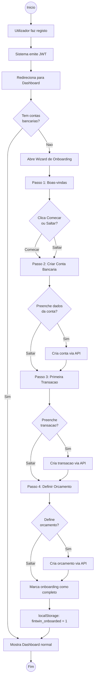
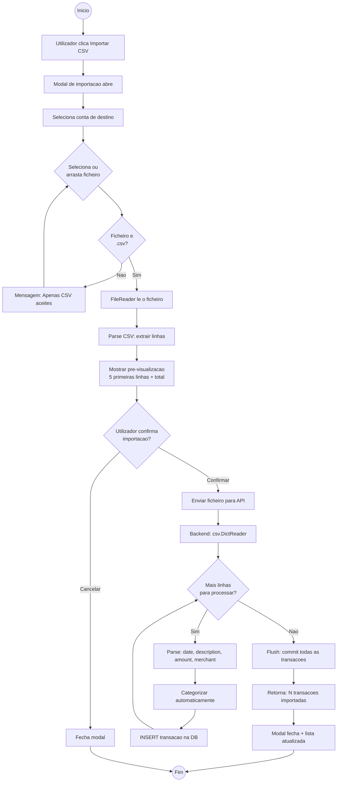
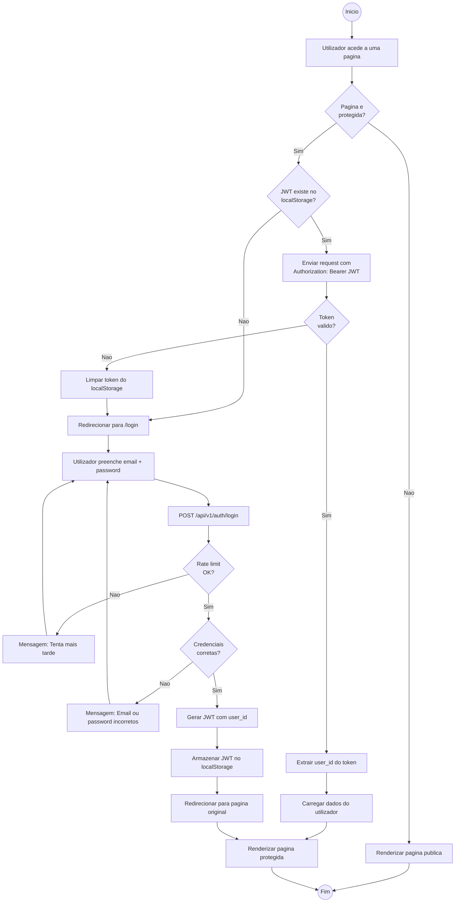

# FinTwin — Diagramas de Atividade (Sprint 1)

## DA01 — Fluxo de Onboarding (Primeiro Acesso)

---

## DA02 — Fluxo de Importacao CSV

---

## DA03 — Fluxo de Autenticacao (Login + Acesso Protegido)

